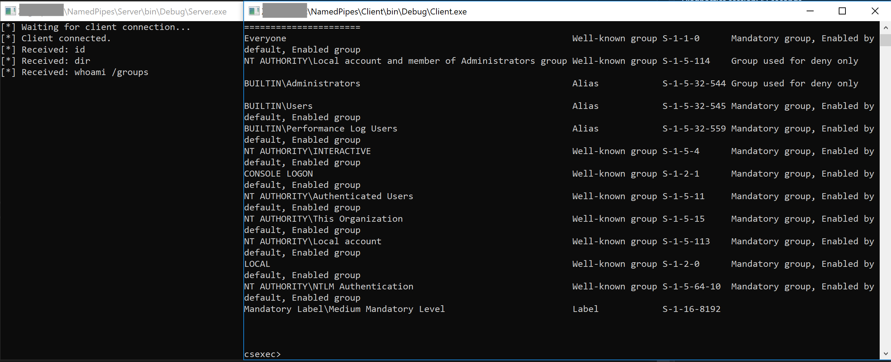

# Named Pipes

Build in Visual Studio (.net 3.5 so it runs on Win 7+). 

This is a proof of concept / pattern concept for creating a client/server communication model with named pipes in C#. In this example, a client passes a message to the server over a named pipe which is then executed as a command on the server. The standard out and standard error are redirected back to the client over the named pipe and printed to the terminal screen.

